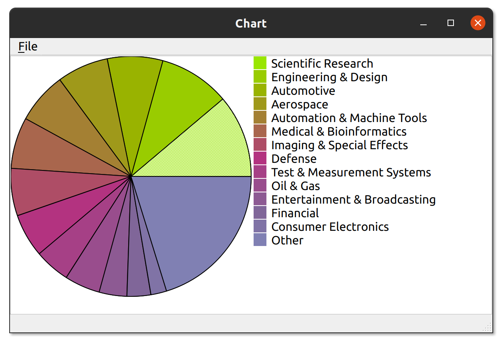

Accessibility for Qt Chart Example
==================================

Demonstrate how to add screen reader support to an item view in Qt. Based on
Qt's [Chart Example] and [QAbstractItemView]. See [commit history] for
details of changes made.

[commit history]: https://github.com/shoogle/accessibility-qt-chart-example/commits/master
[Chart Example]: https://doc.qt.io/qt-5/qtwidgets-itemviews-chart-example.html
[QAbstractItemView]: https://doc.qt.io/qt-5/qabstractitemview.html

## Building

Within Qt Creator, go to *File > Open File or Project*, and navigate to [chart.pro].

[chart.pro]: chart.pro

## License

BSD 3-Clause. See individual code files as well as [LICENSE.txt] for details.

[LICENSE.txt]: LICENSE.txt
